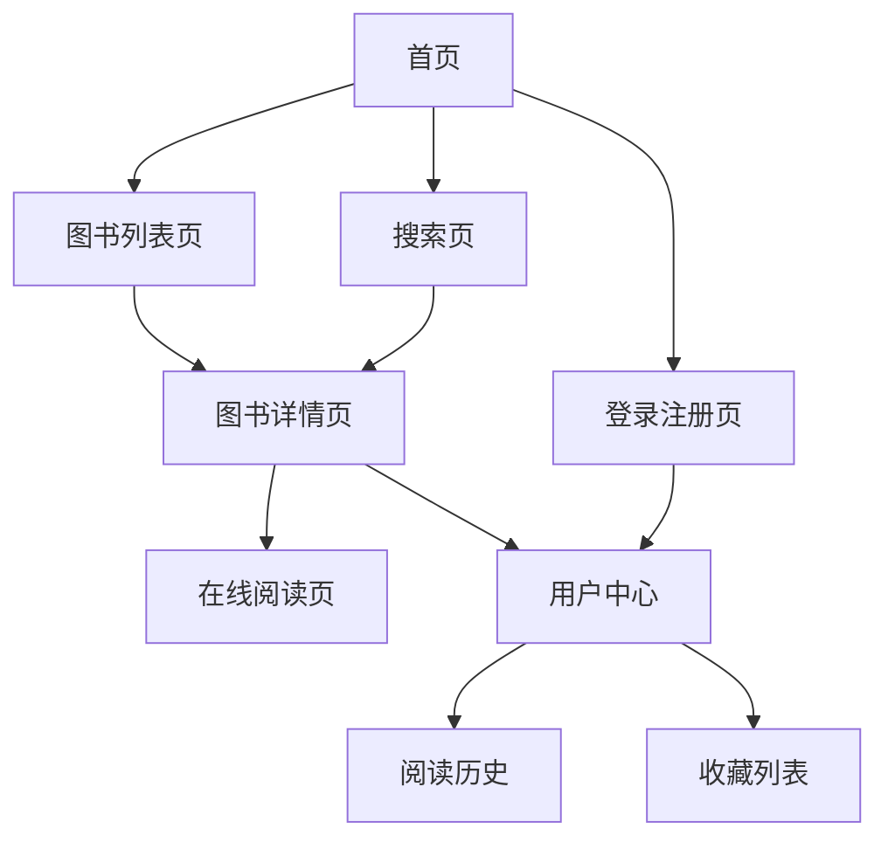

## 1. 产品概述

数字图书馆网站是一个前后端分离的在线阅读平台，用户可以在网站上浏览和阅读不同类型的电子书籍。

该平台解决了传统图书馆的时空限制问题，为读者提供24小时在线访问海量图书资源的便利。目标用户包括学生、研究人员、职场人士和所有热爱阅读的人群。

## 2. 核心功能

### 2.1 用户角色

| 角色   | 注册方式 | 核心权限                    |
| ---- | ---- | ----------------------- |
| 普通用户 | 邮箱注册 | 浏览图书目录、在线阅读、收藏图书、查看阅读历史 |
| 管理员  | 后台创建 | 图书管理、用户管理、分类管理、系统设置     |

### 2.2 功能模块

数字图书馆网站包含以下核心页面：

1. **首页**：图书推荐、分类导航、搜索功能、热门图书展示
2. **图书列表页**：分类浏览、筛选排序、分页加载
3. **图书详情页**：图书信息、在线阅读、收藏功能、相关推荐
4. **用户中心**：个人信息、阅读历史、收藏列表、设置选项
5. **登录注册页**：用户认证、密码找回、第三方登录
6. 支持PDF、EPUB等格式的在线阅读。

### 2.3 页面详情

| 页面名称  | 模块名称 | 功能描述                    |
| ----- | ---- | ----------------------- |
| 首页    | 搜索栏  | 支持按书名、作者、ISBN搜索图书       |
| 首页    | 分类导航 | 展示文学、科技、历史等分类，点击跳转到对应列表 |
| 首页    | 推荐图书 | 基于用户兴趣推荐个性化图书内容         |
| 图书列表页 | 分类筛选 | 按类别、标签、出版时间筛选图书         |
| 图书列表页 | 排序功能 | 支持按热度、评分、时间排序           |
| 图书列表页 | 分页加载 | 滚动加载更多图书，优化性能           |
| 图书详情页 | 图书信息 | 展示封面、标题、作者、简介、评分等基本信息   |
| 图书详情页 | 在线阅读 | 提供翻页阅读、字体调节、夜间模式        |
| 图书详情页 | 收藏功能 | 用户可收藏感兴趣的图书到个人中心        |
| 用户中心  | 个人信息 | 显示用户名、邮箱、注册时间等基本信息      |
| 用户中心  | 阅读历史 | 记录用户最近阅读的图书和阅读进度        |
| 用户中心  | 收藏列表 | 展示用户收藏的所有图书             |
| 登录注册页 | 用户认证 | 支持邮箱密码登录和注册新账户          |
| 登录注册页 | 密码找回 | 通过邮箱验证找回遗忘的密码           |

## 3. 核心流程

用户访问网站后，可以在首页浏览推荐图书或通过搜索、分类导航找到感兴趣的图书。点击图书进入详情页后可查看详细信息并开始在线阅读。注册用户还可以收藏图书、查看阅读历史等个性化功能。

管理员通过后台管理系统进行图书上传、分类管理、用户权限设置等操作。

## 4. 用户界面设计

### 4.1 设计风格

* **主色调**：深蓝色(#1e3a8a)搭配白色背景，营造专业的学术氛围

* **辅助色**：浅灰色(#f3f4f6)用于卡片背景，橙色(#f97316)用于重要按钮

* **按钮样式**：圆角矩形设计，hover效果使用轻微阴影

* **字体选择**：中文使用思源黑体，英文使用Inter，正文字号14-16px

* **布局风格**：卡片式网格布局，顶部固定导航栏

* **图标风格**：使用简洁的线性图标，保持一致性

### 4.2 页面设计概述

| 页面名称  | 模块名称 | UI元素                       |
| ----- | ---- | -------------------------- |
| 首页    | 导航栏  | 白色背景，包含logo、搜索框、用户头像，固定在顶部 |
| 首页    | 推荐区域 | 轮播图展示热门图书，自动切换，支持手动控制      |
| 首页    | 分类卡片 | 网格布局展示分类，每个卡片包含图标和名称       |
| 图书列表页 | 侧边栏  | 左侧显示分类树形结构，支持多级展开          |
| 图书列表页 | 图书网格 | 响应式网格，每行4-6本书，显示封面和基本信息    |
| 图书详情页 | 左侧信息 | 大图封面占据左侧1/3区域              |
| 图书详情页 | 右侧详情 | 标题、作者、评分、简介垂直排列，阅读按钮醒目     |
| 在线阅读页 | 阅读器  | 模拟真实书籍，支持翻页动画，可调节字体大小      |
| 用户中心  | 标签页  | 顶部标签切换个人信息、阅读历史、收藏列表       |

### 4.3 响应式设计

采用桌面端优先的设计策略，确保在大屏幕上展示丰富的内容和功能。同时针对平板和手机进行适配：

* 平板端：调整网格列数，优化触摸操作区域

* 手机端：采用单栏布局，隐藏次要功能到汉堡菜单

* 支持横竖屏切换，优化不同屏幕尺寸下的阅读体验

### 4.4 无障碍设计

* 支持键盘导航操作

* 提供高对比度模式

* 图片添加alt属性描述

* 字体大小可调节

