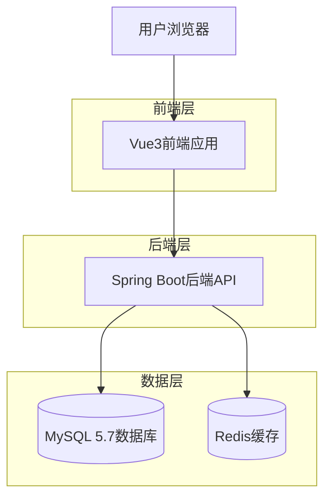
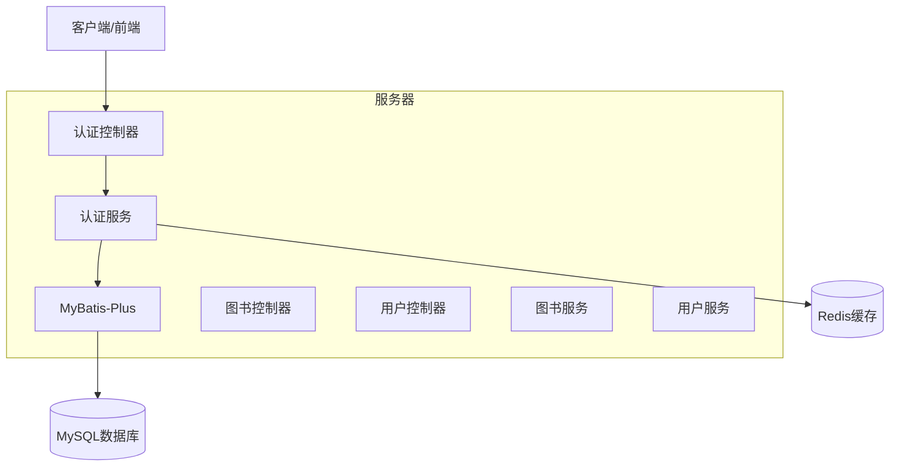
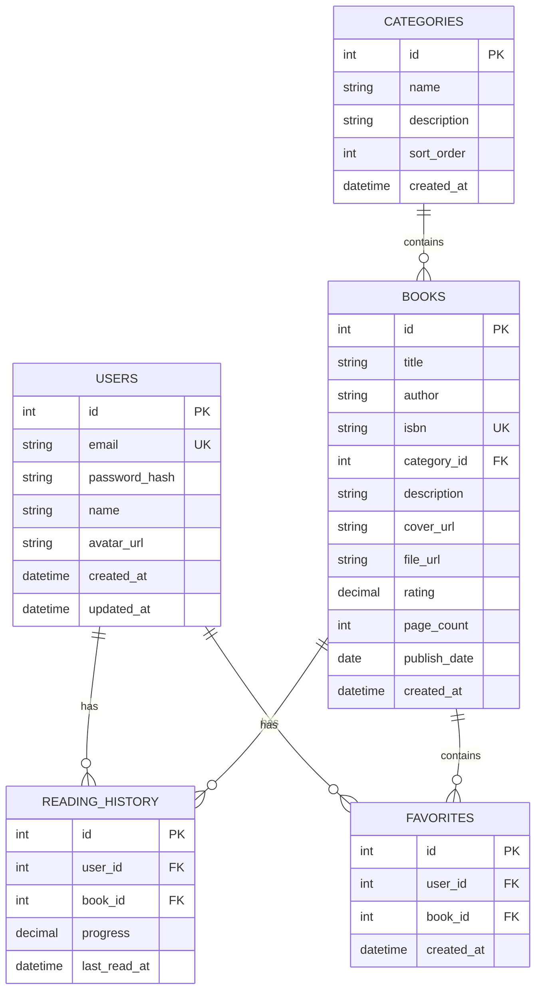

## 1. 架构设计



## 2. 技术描述

* **前端**: Vue3 + Vite

* **初始化工具**: vite-init

* **后端**: Java 21 + Spring Boot

* **数据库**: MySQL 5.7 + Redis

* **身份认证**: JWT

## 3. 路由定义

| 路由         | 用途                |
| ---------- | ----------------- |
| /          | 首页，展示推荐图书和分类导航    |
| /books     | 图书列表页，支持分类和搜索     |
| /books/:id | 图书详情页，展示详细信息和阅读入口 |
| /read/:id  | 在线阅读页面，提供阅读器功能    |
| /login     | 登录页面，用户身份验证       |
| /register  | 注册页面，新用户注册        |
| /profile   | 用户中心，个人信息和阅读历史    |
| /favorites | 收藏列表，用户收藏的图书      |

## 4. API定义

### 4.1 核心API

**用户认证相关**

```
POST /api/auth/login
```

请求参数:

| 参数名      | 参数类型   | 是否必需 | 描述     |
| -------- | ------ | ---- | ------ |
| email    | string | true | 用户邮箱地址 |
| password | string | true | 用户密码   |

响应参数:

| 参数名   | 参数类型   | 描述      |
| ----- | ------ | ------- |
| token | string | JWT访问令牌 |
| user  | object | 用户信息对象  |

请求示例:

```json
{
  "email": "user@example.com",
  "password": "123456"
}
```

**图书列表获取**

```
GET /api/books
```

查询参数:

| 参数名      | 参数类型   | 是否必需  | 描述        |
| -------- | ------ | ----- | --------- |
| category | string | false | 图书分类      |
| page     | number | false | 页码，默认为1   |
| limit    | number | false | 每页数量，默认20 |
| search   | string | false | 搜索关键词     |

**图书详情获取**

```
GET /api/books/:id
```

路径参数:

| 参数名 | 参数类型   | 是否必需 | 描述   |
| --- | ------ | ---- | ---- |
| id  | string | true | 图书ID |

**添加到收藏**

```
POST /api/books/:id/favorite
```

请求头:

```
Authorization: Bearer <token>
```

### 4.2 TypeScript类型定义

```typescript
// 用户类型
interface User {
  id: string;
  email: string;
  name: string;
  avatar?: string;
  createdAt: Date;
}

// 图书类型
interface Book {
  id: string;
  title: string;
  author: string;
  isbn: string;
  category: string;
  description: string;
  coverUrl: string;
  fileUrl: string;
  rating: number;
  publishDate: Date;
  pageCount: number;
  createdAt: Date;
}

// 阅读历史类型
interface ReadingHistory {
  id: string;
  userId: string;
  bookId: string;
  progress: number; // 阅读进度百分比
  lastReadAt: Date;
}
```

## 5. 服务器架构图



## 6. 数据模型

### 6.1 数据模型定义



### 6.2 数据定义语言

**用户表 (users)**

```sql
-- 创建用户表
CREATE TABLE users (
  id INT AUTO_INCREMENT PRIMARY KEY,
  email VARCHAR(255) UNIQUE NOT NULL,
  password_hash VARCHAR(255) NOT NULL,
  name VARCHAR(100) NOT NULL,
  avatar_url VARCHAR(500),
  created_at DATETIME DEFAULT CURRENT_TIMESTAMP,
  updated_at DATETIME DEFAULT CURRENT_TIMESTAMP ON UPDATE CURRENT_TIMESTAMP
);

-- 创建索引
CREATE INDEX idx_users_email ON users(email);
```

**图书表 (books)**

```sql
-- 创建图书表
CREATE TABLE books (
  id INT AUTO_INCREMENT PRIMARY KEY,
  title VARCHAR(255) NOT NULL,
  author VARCHAR(255) NOT NULL,
  isbn VARCHAR(20) UNIQUE,
  category_id INT,
  description TEXT,
  cover_url VARCHAR(500),
  file_url VARCHAR(500) NOT NULL,
  rating DECIMAL(3,2) DEFAULT 0.00,
  page_count INT DEFAULT 0,
  publish_date DATE,
  created_at DATETIME DEFAULT CURRENT_TIMESTAMP,
  INDEX idx_category (category_id),
  INDEX idx_author (author),
  INDEX idx_created_at (created_at)
);
```

**分类表 (categories)**

```sql
-- 创建分类表
CREATE TABLE categories (
  id INT AUTO_INCREMENT PRIMARY KEY,
  name VARCHAR(100) NOT NULL,
  description TEXT,
  sort_order INT DEFAULT 0,
  created_at DATETIME DEFAULT CURRENT_TIMESTAMP
);

-- 插入初始分类数据
INSERT INTO categories (name, description, sort_order) VALUES
('文学', '小说、诗歌、散文等文学作品', 1),
('科技', '计算机、工程、科学等科技类图书', 2),
('历史', '历史、传记、考古等历史相关图书', 3),
('经济', '经济、金融、管理等商业类图书', 4),
('艺术', '绘画、音乐、设计等艺术类图书', 5);
```

**阅读历史表 (reading\_history)**

```sql
-- 创建阅读历史表
CREATE TABLE reading_history (
  id INT AUTO_INCREMENT PRIMARY KEY,
  user_id INT NOT NULL,
  book_id INT NOT NULL,
  progress DECIMAL(5,2) DEFAULT 0.00,
  last_read_at DATETIME DEFAULT CURRENT_TIMESTAMP,
  UNIQUE KEY unique_user_book (user_id, book_id),
  INDEX idx_user_id (user_id),
  INDEX idx_book_id (book_id),
  INDEX idx_last_read (last_read_at)
);
```

**收藏表 (favorites)**

```sql
-- 创建收藏表
CREATE TABLE favorites (
  id INT AUTO_INCREMENT PRIMARY KEY,
  user_id INT NOT NULL,
  book_id INT NOT NULL,
  created_at DATETIME DEFAULT CURRENT_TIMESTAMP,
  UNIQUE KEY unique_user_book (user_id, book_id),
  INDEX idx_user_id (user_id),
  INDEX idx_book_id (book_id),
  INDEX idx_created (created_at)
);
```

