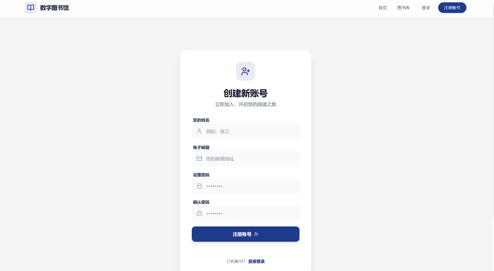
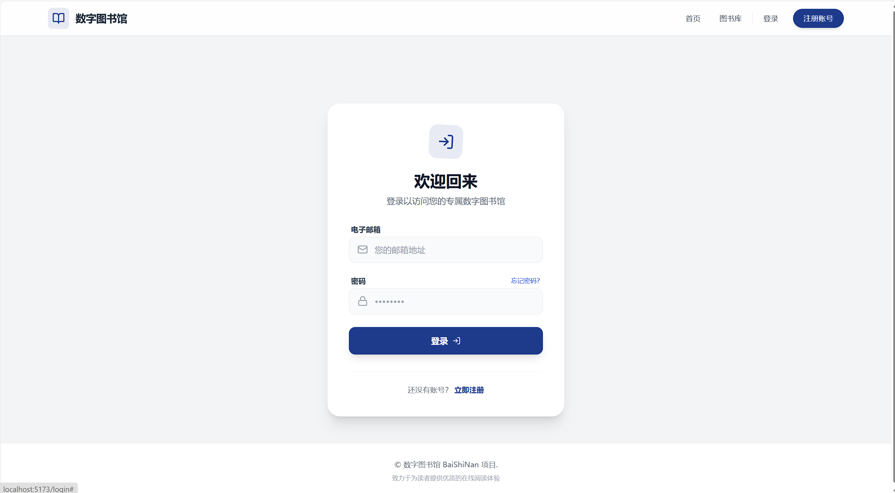
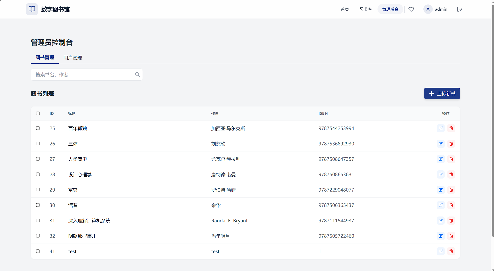
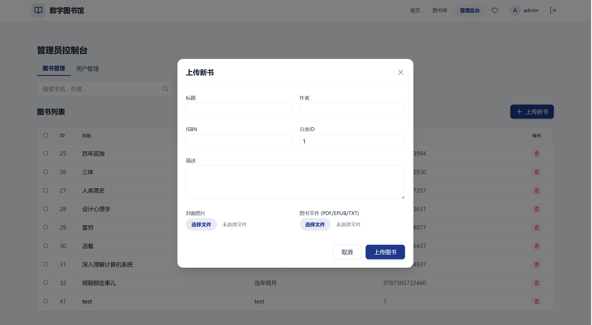
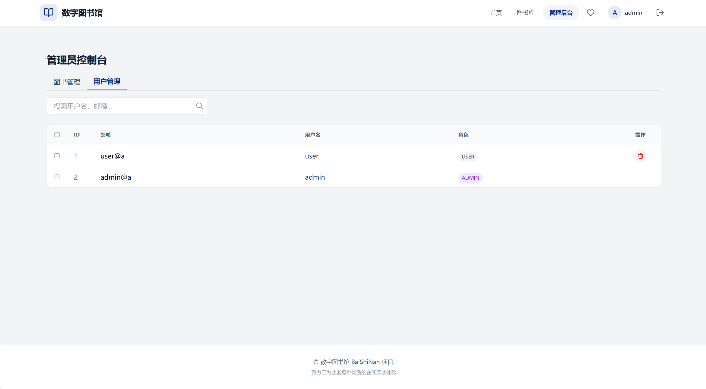
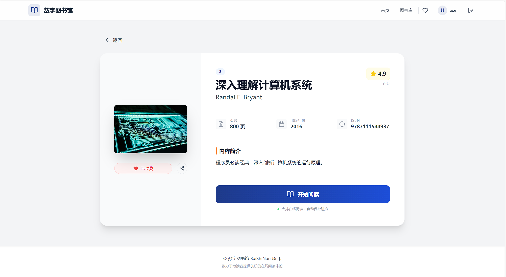
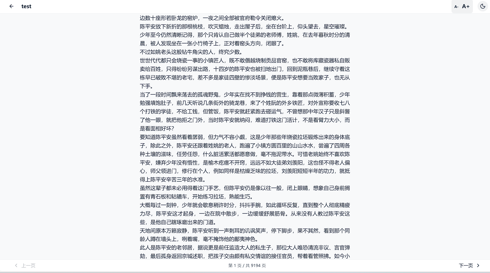

### 主要功能模块 
1. 用户认证与安全: 
   - 实现了基于 JWT 的用户注册、登录认证流程。 
   - 集成了 Spring Security 进行接口权限控制（RBAC模型），区分普通用户与管理员权限。 
2. 图书管理与检索: 
   - 支持图书的增删改查及批量操作。 
   - 实现了基于分类和关键词的图书检索功能。 
   - 支持图书封面与 PDF 文件的高效上传与存储管理。 
3. 在线阅读体验: 
   - 集成了 PDF.js 实现了浏览器端的 PDF 在线阅读器。 
   - 开发了 阅读历史功能，记录用户的阅读书籍。 
4. 个性化服务: 
   - 收藏夹: 用户可一键收藏/取消收藏感兴趣的图书。 
   - 个人中心: 用户可管理个人资料及查看阅读历史记录。 
5. 后台管理系统: 
   - 提供了可视化的后台管理界面，支持管理员对图书信息进行维护。 
   - 实现了用户管理功能，支持查看用户列表及账号管理。 

  注册 
    
  登录 
    
   首页 
    
  收藏 
    
  图书库 
    
   个人中心 
    
    管理员书籍管理 
    
   管理员书籍上传 
    
    管理员用户管理 
    
    书本详细 
    
    阅读 
    
   
